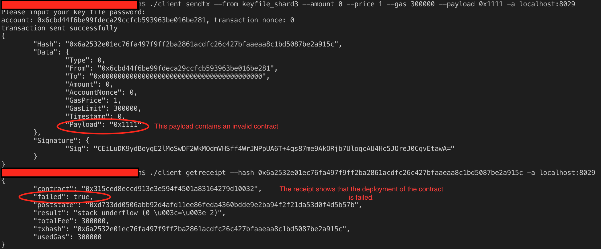

# 1. Why is my node not synchronizing to the most recent blocks?
Seele utilizes a unique sharding technique. It requires your node to connect to all the shards in order to process cross-shard transactions flawlessly. If your node is not connected to a particular shard, it cannot verify the block with cross-shard transactions from that shard. Hence the synchronization stops. To check whether your node is connected to all the shards, you can use
./client p2p peersinfo
under go-seele/build/ directory (after you build go-seele) to check all the nodes you have connected to. You can see the shard information of each node.
Sometimes it takes a long time to sync due to complicated network environment. Please be patient.
# 2. How do I know if I have mined a block?
You can check on Seelescan with your coinbase(account). Even though the log showing on your local machine says you have mined a block, it may not be the final result on the Mainnet because your mined block needs to be recognized by the mining community. You may also use
./client getbalance --account (your account) -a ip:port
to check whether your balance is increasing. We recommend using the IP of static nodes or some trusted IPs you find on Seelescan. The port should be adjusted based on the shard. Shard 1: 8027, shard 2: 8028, shard 3: 8029, shard 4: 8026.
# 3. How long does it take for a cross-shard transaction to complete?
The cross-shard transaction usually takes at least 20 minutes to complete, normally between 20 minutes and 30 minutes. Seele has a uinque mechanism to guarantee the ultimate safety of the cross-shard transaction. Don’t worry if you haven’t seen the transaction completed for a long time. Please report it to the team.
# 4. Is cross-shard contract supported in Seele?
No. Currently we only support intra-shard contracts.
# 5. Where is the blockchain data stored on my computer?
By default, the data folder is ~/.seele. If you delete this folder and restart your node, you will synchronize the data from scratch.
# 6. How to handle the “too many open files” error when you run a seele node?
Mac’s default upper limit for the number of files a process can open at the same time may be too low for a seele node.
In terminal, type the commandlaunchctl limit maxfiles.The response should bemaxfiles 256 unlimitedwhere 256 is ‘soft limit’ and unlimited is ‘hard limit’.
Use the commandsudo launchctl limit maxfiles 65536 200000to change the two limits and this time the reponse to launchctl limit maxfiles should be maxfiles 65536 200000. You’re expected to input your password for the sudo command. Refer to this blog if the above didn’t solve your problem.
# 7. "invalid content type, only application/json is supported" error when using curl
Add -H "Content-Type: application/json"  to your curl statement.

# 8. The tx receipt shows that my contract deployment is failed,  but the same contract is packed repeatly on chain?
To avoid this from happening, please make sure your contracts are written correctly before deploying them on Seele. We recommend using Remix, Truffle or other Ethereum IDEs to develop your contracts. Please refer to this link for an example. 
The following shows how to check the tx receipt of your contract deployment.

A simple workaround to stop the repeated packing is to send another tx (preferably an account-to-account transfer with a small amount) from the same account where you send out the contract deployment tx. See following for an example.

This method will increase the nonce of your account and prevent the packing of txs with smaller nonces. We will release a new version to completely avoid this issue in the near future.